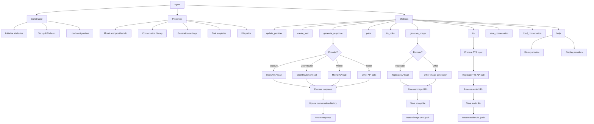

# Agent.py API Reference

## Class: Agent

The `Agent` class represents an AI agent capable of generating text responses, creating images, and performing text-to-speech operations across multiple AI providers.

## Related Modules
- [DeerTick Main](deertick_doc.md)
- [Model Data](model_data_doc.md)
- [Web Crawler](crawler_doc.md)
- [Dynamic Blog Scraper](scraper_doc.md)

This module is a core component of the DeerTick project. For an overview of how it fits into the larger system, see the [DeerTick Main Documentation](deertick_doc.md).

### Dependencies

- `requests`: For making HTTP requests to AI providers
- `json`: For parsing JSON responses
- `os`: For environment variable access and file operations
- `mistralai`: For interacting with the Mistral AI API
- `openai`: For interacting with the OpenAI API

### Constructor

```python
Agent(model, system_prompt='', provider='', settings=None)
```

- `model` (str): The name or identifier of the AI model to use.
- `system_prompt` (str, optional): Initial system prompt for the agent.
- `provider` (str, optional): The AI provider (e.g., 'openai', 'openrouter', 'mistral', 'replicate', 'anthropic', 'google', 'huggingface').
- `settings` (dict, optional): Additional settings for the agent.

### Properties

- `model` (str): The current model being used.
- `provider` (str): The current AI provider.
- `system_prompt` (str): The system prompt for the agent.
- `tools` (list): List of available tools for the agent.
- `conversation` (dict): Stores the conversation history.
- `content` (str): The latest generated content.
- `last_response` (list or str): The last response from the AI.
- `nickname` (str): A nickname for the agent, defaults to the model name.
- `color` (str or None): The color associated with the agent, if any.
- `font` (str or None): The font associated with the agent, if any.
- `request` (object): Stores the last API request made.
- `response` (object): Stores the full response from the last API call.
- `history` (bool): Flag to indicate if conversation history should be used.
- `tts_path` (str): Path for text-to-speech output files.
- `img_path` (str): Path for generated image output files.
- `output_format` (str): Format for output files (e.g., 'webp' for images).
- `num_outputs` (int): Number of outputs to generate (for image generation).
- `lora_scale` (float): Scale factor for LoRA models.
- `aspect_ratio` (str): Aspect ratio for generated images.
- `guidance_scale` (float): Guidance scale for image generation.
- `num_inference_steps` (int): Number of inference steps for image generation.
- `disable_safety_checker` (bool): Flag to disable safety checks in image generation.
- `seed` (int or None): Seed for random number generation.
- `audio_path` (str): Path for audio output files.
- `max_tokens` (int): Maximum number of tokens for text generation.
- `min_tokens` (int): Minimum number of tokens for text generation.
- `temperature` (float): Temperature for text generation.
- `presence_penalty` (float): Presence penalty for text generation.
- `frequency_penalty` (float): Frequency penalty for text generation.
- `top_k` (int): Top-k sampling parameter.
- `top_p` (float): Top-p sampling parameter.
- `repetition_penalty` (float): Penalty for repetition in text generation.
- `min_p` (float): Minimum probability for token selection.
- `top_a` (float): Top-a sampling parameter.
- `logit_bias` (dict): Bias for logits in text generation.
- `logprobs` (bool): Whether to return log probabilities of output tokens.
- `top_logprobs` (int or None): Number of top log probabilities to return.
- `response_format` (dict or None): Specified format for the response.
- `stop` (list): List of stop sequences for text generation.
- `tool_choice` (str or None): Specified tool choice for function calling.
- `prompt_template` (str): Template for formatting prompts.
- `settings` (dict): Stores generation settings in the correct format for the model.
- `tool_template` (dict): Template for defining new tools. Structure:
  ```python
  {
      "type": "function",
      "function": {
          "description": "",
          "parameters": {
              "type": "object",
              "properties": {},
              "required": [],
              "additionalProperties": False,
          },
      }
  }
  ```
  This template is used to create new tools with the `create_tool` method.

## Diagram
### Agent Class Structure and Workflow



### Methods

#### update_provider(provider)

Updates the provider and model for the agent.

- `provider` (str): The name of the provider to use.

#### create_tool(name, description, parameters)

Creates a new tool for the agent.

- `name` (str): The name of the tool.
- `description` (str): A brief description of what the tool does.
- `parameters` (dict): A dictionary describing the parameters for the tool.

#### generate_response(system_prompt, prompt)

Generates a response based on the given system prompt and user prompt.

- `system_prompt` (str): The system instructions for the AI.
- `prompt` (str): The user's input prompt.

Returns: The generated response (str or list).

#### poke(prompt)

A simplified interface to generate a response.

- `prompt` (str): The user's input prompt.

Returns: The generated response (str or list).

#### tts_poke(prompt, voice)

Generates a text-to-speech response.

- `prompt` (str): The text to convert to speech.
- `voice` (str, optional): The voice sample to use.

Returns: Path to the generated audio file (str).

#### generate_image(prompt, file_path=None)

Generates an image based on the given prompt.

- `prompt` (str): The description of the image to generate.
- `file_path` (str, optional): The path to save the generated image.

Returns: URL or path of the generated image (str).

#### help()

Provides help information about the agent's capabilities.

Returns: A string containing help information.

## Usage Example

```python
agent = Agent(model="gpt-3.5-turbo", provider="openai")
response = agent.poke("Tell me a joke about programming.")
print(response)

image_url = agent.generate_image("A serene landscape with mountains and a lake")
print(f"Generated image: {image_url}")

agent.update_provider("mistral")
mistral_response = agent.poke("Explain quantum computing.")
print(mistral_response)
```

## Notes

- The `Agent` class supports multiple AI providers and models, including OpenAI, OpenRouter, Mistral, Replicate, Anthropic, Google, and Hugging Face.
- The `update_provider` method allows switching between different AI providers dynamically.
- Image generation and text-to-speech functionalities depend on the chosen provider and model.
- The `tools` feature allows for extending the agent's capabilities with custom functions.
- The class handles different initialization and API call procedures for each provider.
- Error handling is implemented for API calls, with detailed error messages printed for debugging.
- The conversation history is maintained and can be used in generating responses if the `history` flag is set.
- The class supports various parameters for fine-tuning text generation, such as temperature, top_k, top_p, and various penalties.
- API keys are expected to be set as environment variables (e.g., `OPENAI_API_KEY`, `MISTRAL_API_KEY`, `OPENROUTER_API_KEY`).