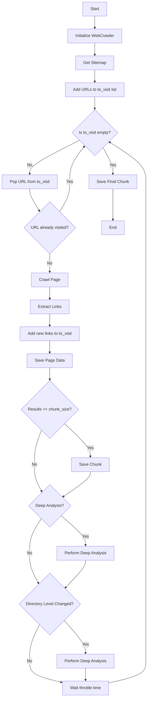

# WebCrawler API Reference

## Class: WebCrawler

A web crawler that performs both normal and deep analysis of web pages.

## Related Modules
- [DeerTick Main](deertick_doc.md)
- [Agent](agent_doc.md)
- [Database Manager](db_doc.md)

This module is used for web crawling in the DeerTick project. For an overview of how it fits into the larger system, see the [DeerTick Main Documentation](deertick_doc.md).

### Constructor

```python
WebCrawler(start_url, chunk_size=100, total_chunks=None, deep_analysis=False, deep_analysis_on_level_change=False)
```

- `start_url` (str): The starting URL for the crawl.
- `chunk_size` (int): Number of pages to crawl before saving results.
- `total_chunks` (int or None): Total number of chunks to crawl, or None for unlimited.
- `deep_analysis` (bool): Whether to perform deep analysis on every page.
- `deep_analysis_on_level_change` (bool): Whether to perform deep analysis when directory level changes.

### Attributes

- `start_url` (str): The starting URL for the crawl.
- `domain` (str): The domain of the starting URL.
- `agent` (Agent): An AI agent for analysis.
- `driver` (webdriver.Chrome): Selenium WebDriver instance.
- `visited` (set): Set of visited URLs.
- `to_visit` (list): List of URLs to visit.
- `results` (list): List of crawl results.
- `throttle` (float): Delay between requests.
- `chunk_size` (int): Number of pages to crawl before saving results.
- `total_chunks` (int or None): Total number of chunks to crawl.
- `current_chunk` (int): Current chunk number.
- `deep_dive` (pandas.DataFrame or None): Results of deep analysis.
- `deep_analysis` (bool): Whether to perform deep analysis on every page.
- `deep_analysis_on_level_change` (bool): Whether to perform deep analysis when directory level changes.
- `current_directory_level` (int): Current directory level of the URL being crawled.
- `df` (pandas.DataFrame): DataFrame to store crawl results.

### Methods

#### setup_selenium()
Sets up and returns a Selenium WebDriver instance.
Returns: webdriver.Chrome instance.

#### get_sitemap()
Retrieves the sitemap of the website.
Returns: List of URLs from the sitemap.

#### is_allowed_by_robots(url, user_agent='*')
Checks if crawling a URL is allowed by the site's robots.txt.
- `url` (str): URL to check.
- `user_agent` (str): User agent to check against.
Returns: Boolean indicating if crawling is allowed.

#### is_same_domain(url)
Checks if a URL is from the same domain as the start URL.
- `url` (str): URL to check.
Returns: Boolean indicating if URL is from the same domain.

#### normalize_url(url)
Normalizes a URL by removing trailing slashes and converting to lowercase.
- `url` (str): URL to normalize.
Returns: Normalized URL string.

#### clean_and_parse_dict(text)
Cleans and parses a dictionary-like string into a Python dictionary.
- `text` (str): String representation of a dictionary.
Returns: Parsed Python dictionary.

#### deep_page_analysis(url)
Performs a deep analysis of a web page using AI.
- `url` (str): URL of the page to analyze.
Returns: Tuple (selenium_required, description, challenges, notes).

#### crawl_page(url)
Crawls a single page and extracts information.
- `url` (str): URL of the page to crawl.
Returns: Tuple (links, selenium_required, description, errors, additional_notes).

#### save_chunk()
Saves the current chunk of crawl results to a CSV file.

#### get_directory_level(url)
Gets the directory level of a URL.
- `url` (str): URL to analyze.
Returns: Integer representing the directory level.

#### crawl_website()
Main method to crawl the website starting from the initial URL.

#### write_to_csv(url, description)
Writes crawl results to a CSV file.
- `url` (str): URL of the crawled page.
- `description` (str): Description of the page content.

### Usage Example

```python
start_url = "https://www.example.com/"
crawler = WebCrawler(start_url, chunk_size=50, total_chunks=None)
crawler.crawl_website()
```

## Flow


## Dependencies

- requests
- beautifulsoup4
- selenium
- pandas
- Agent (custom class)
- logging
- csv
- json
- time
- urllib.parse
- xml.etree.ElementTree
- urllib.robotparser

## Notes

- The crawler respects robots.txt rules and implements polite crawling with delays.
- It can perform both normal crawling and deep analysis of pages.
- Results are saved in chunks to CSV files.
- The crawler uses Selenium for JavaScript-rendered content and falls back to requests for static pages.
- Deep analysis is performed using an AI agent to extract detailed information about page structure and content.