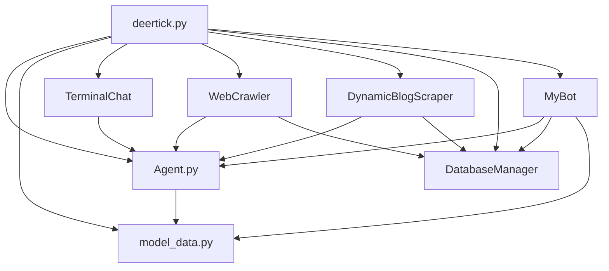

# DeerTick API Reference

## Related Modules
- [Agent](agent_doc.md)
- [Model Data](model_data_doc.md)
- [Web Crawler](crawler_doc.md)
- [Dynamic Blog Scraper](scraper_doc.md)
- [Database Manager](db_doc.md)
- [Discord Bot](bot_doc.md)

For a complete overview of the project structure, see the [Project Overview](#overview) section below.

## Overview

DeerTick is a versatile Python-based interface for interacting with various language models from different providers, including Replicate, OpenAI, Hugging Face, OpenRouter, and Mistral. It provides a unified way to manage AI agents and integrate them into various workflows, including web crawling, scraping, database operations, Discord bot functionality, image generation, and text-to-speech capabilities.



The `deertick.py` file serves as the main entry point for the DeerTick toolbox, providing a command-line interface to interact with various AI models and providers, as well as additional functionalities.

## Module: deertick

### Command-line Interface

The `deertick.py` script can be run from the command line with various options:

#### Options:

- `-m`, `--model MODEL`: Specify the model to use (e.g., "I-8b", "I-70b", "gpt-4")
- `-p`, `--provider PROVIDER`: Specify the provider (e.g., "replicate", "anthropic")
- `-s`, `--system PROMPT`: Set the system prompt for the conversation
- `-i`, `--interactive`: Start an interactive chat session
- `-f`, `--file FILE`: Read input from a file
- `-o`, `--output FILE`: Write output to a file
- `-h`, `--help`: Show the help message
- `-l`, `--list`: List available models and providers
- `--crawl URL`: Start a web crawl from the specified URL
- `--scrape URL`: Scrape content from the specified URL
- `--deep-analysis`: Perform deep analysis during web crawling
- `--export-db`: Export scraped data to the database
- `--backup-db`: Create a backup of the entire database
- `--discord`: Start the Discord bot
- `--generate-image PROMPT`: Generate an image based on the given prompt
- `--tts TEXT`: Convert the given text to speech
- `--voice VOICE`: Specify the voice to use for text-to-speech
- `--create-agent NAME`: Create a new agent with the specified name
- `--delete-agent NAME`: Delete the agent with the specified name
- `--agent-info NAME`: Display information about the specified agent
- `--set-param AGENT PARAM VALUE`: Set a parameter for the specified agent
- `--list-agents`: List all available agents

### Main Functionality

The script now provides multiple modes of operation:

1. **List Models and Providers**: Displays all available models and providers.
2. **Interactive Chat**: Starts an interactive chat session using the specified model and provider.
3. **File Processing**: Processes input from a file and generates a response.
4. **Web Crawling**: Performs web crawling with optional deep analysis.
5. **Web Scraping**: Scrapes content from a specified URL with optional database export.
6. **Database Backup**: Creates a backup of the entire database.
7. **Discord Bot**: Starts the Discord bot for interactive conversations.
8. **Image Generation**: Generates images based on text prompts.
9. **Text-to-Speech**: Converts text to speech with optional voice selection.
10. **Agent Management**: Creates, deletes, modifies, and lists AI agents.

### Dependencies

- `argparse`: For parsing command-line arguments
- `Agent`: Custom class for managing AI agents
- `model_data`: Module containing model and provider information
- `TerminalChat`: Custom class for handling interactive chat sessions
- `WebCrawler`: Class for web crawling functionality
- `DynamicBlogScraper`: Class for web scraping functionality
- `DatabaseManager`: Class for database operations
- `MyBot`: Custom Discord bot class
- `asyncio`: For asynchronous operations
- `discord`: For Discord bot functionality

### Usage Examples

1. List available models and providers:
   ```
   python deertick.py -l
   ```

2. Start an interactive chat session:
   ```
   python deertick.py -i -m 405b-base -p openrouter
   ```

3. Process input from a file and save output:
   ```
   python deertick.py -f input.txt -o output.txt -m gpt-4 -p openai
   ```

4. Start a web crawl with deep analysis:
   ```
   python deertick.py --crawl https://example.com --deep-analysis
   ```

5. Scrape content and export to database:
   ```
   python deertick.py --scrape https://example.com/blog --export-db
   ```

6. Generate an image:
   ```
   python deertick.py --generate-image "A serene landscape with mountains and a lake"
   ```

7. Convert text to speech:
   ```
   python deertick.py --tts "Hello, world!" --voice "en-US-Neural2-F"
   ```

8. Create a new agent:
   ```
   python deertick.py --create-agent "MyNewAgent" -m gpt-4 -p openai
   ```

### Notes

- The script reads API keys from a `config.ini` file.
- It supports various models across different providers.
- The interactive mode includes options for name mention probability and random response probability.
- Some functionalities (like database operations for agent management) may require further implementation.
- Ensure all imported modules and classes are properly implemented and available in your project structure.

This `deertick.py` script serves as a comprehensive command-line tool for accessing various functionalities of the DeerTick toolbox, making it easy to experiment with different configurations and use cases.

