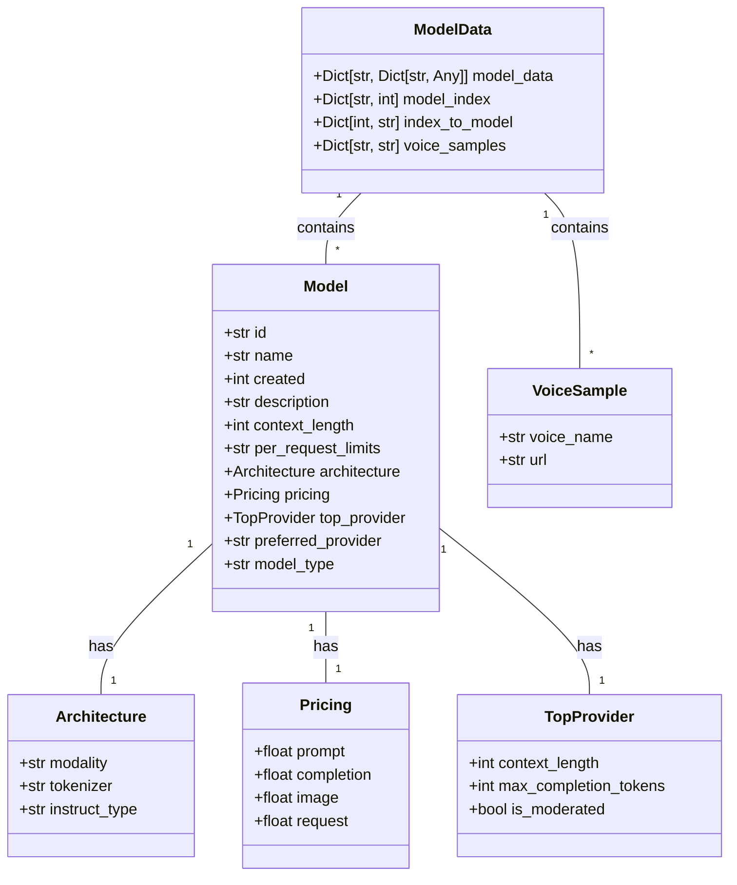

# model_data.py API Reference

## Related Modules
- [DeerTick Main](deertick_doc.md)
- [Agent](agent_doc.md)

This module provides data structures used throughout the DeerTick project. For an overview of how it fits into the larger system, see the [DeerTick Main Documentation](deertick_doc.md).

## Overview
This script loads model data from a CSV file and voice sample data from another CSV file, organizing the information into easily accessible dictionaries.

## Global Variables

### model_data
- Type: dict
- Description: A nested dictionary containing all data for each model.
- Structure: `{model_name: {column_name: value}}`
- Fields:
  - id: str - Unique identifier for the model
  - name: str - Name of the model
  - created: int - Timestamp of when the model was created
  - description: str - Detailed description of the model
  - context_length: int - Maximum context length the model can handle
  - per_request_limits: str or None - Limits per request, if any
  - architecture.modality: str - The modality of the model (e.g., "text->text", "text+image->text")
  - architecture.tokenizer: str - The tokenizer used by the model
  - architecture.instruct_type: str - The instruction type for the model
  - pricing.prompt: float - Price per token for prompts
  - pricing.completion: float - Price per token for completions
  - pricing.image: float - Price for image processing (if applicable)
  - pricing.request: float - Price per request (if applicable)
  - top_provider.context_length: int or None - Context length for the top provider
  - top_provider.max_completion_tokens: int or None - Maximum completion tokens for the top provider
  - top_provider.is_moderated: bool - Whether the top provider is moderated
  - preferred_provider: str - The preferred provider for this model
  - model_type: str - Type of the model (e.g., "llm")
- Example usage: `model_data['Meta: Llama 3.2 3B Instruct']['context_length']`

### model_index
- Type: dict
- Description: Maps model names to their integer index in the CSV file.
- Structure: `{model_name: index}`
- Example usage: `model_index['Meta: Llama 3.2 3B Instruct']`

### index_to_model
- Type: dict
- Description: Maps integer indices to model names.
- Structure: `{index: model_name}`
- Example usage: `index_to_model[0]`

### voice_samples
- Type: dict
- Description: Contains voice sample URLs for different voice names.
- Structure: `{voice_name: url}`
- Example usage: `voice_samples['voice_name']`

## Schema


## Functions
This script does not define any functions. All operations are performed at the module level when the script is run.

## Usage Examples

1. Get the context length of a specific model:
   ```python
   context_length = model_data['Meta: Llama 3.2 3B Instruct']['context_length']
   ```

2. Get the index of a specific model:
   ```python
   index = model_index['Meta: Llama 3.2 3B Instruct']
   ```

3. Get the model name for a specific index:
   ```python
   model_name = index_to_model[0]
   ```

4. Get the URL for a specific voice sample:
   ```python
   url = voice_samples['voice_name']
   ```

5. Iterate through all models and print their pricing:
   ```python
   for model_name, model_info in model_data.items():
       print(f"Model: {model_name}")
       print(f"  Prompt price: {model_info['pricing.prompt']}")
       print(f"  Completion price: {model_info['pricing.completion']}")
   ```

6. Get the description of a model:
   ```python
   description = model_data['Meta: Llama 3.2 3B Instruct']['description']
   ```

7. Check if a model supports image processing:
   ```python
   supports_image = model_data['Meta: Llama 3.2 3B Instruct']['architecture.modality'] == 'text+image->text'
   ```

## Notes
- The script assumes the existence of 'models.csv' and 'samples.csv' files in the same directory.
- Any changes to the structure of these CSV files may require modifications to the script.
- The script prints the number of loaded models and voice samples for verification purposes.
- Some fields may be empty or None for certain models, so it's good practice to check for their existence before using them.
