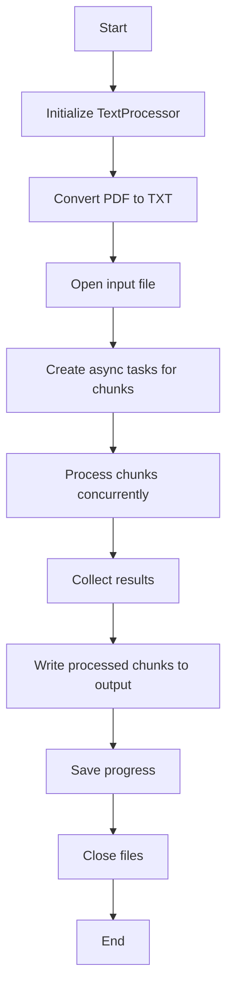

# LineCorrector API Reference

## Class: TextProcessor

A text processor that corrects line formatting in PDF files and text documents.

## Related Modules
- [DeerTick Main](deertick_doc.md)
- [Agent](agent_doc.md)

This module is used for correcting line formatting in the DeerTick project. For an overview of how it fits into the larger system, see the [DeerTick Main Documentation](deertick_doc.md).

### Constructor

```python
TextProcessor(model="cohere/command-r-plus-08-2024", provider="openrouter", chunk_size=5, system_prompt=None)
```

- `model` (str): The AI model to use for text processing.
- `chunk_size` (int): Number of lines to process in each chunk.
- `provider` (str): The AI provider to use.
- `system_prompt` (str or None): Custom system prompt for the AI agent.

### Attributes

- `agent` (Agent): An AI agent for text processing.
- `chunk_size` (int): Number of lines to process in each chunk.
- `default_system_prompt` (str): Default system prompt for the AI agent.
- `logger` (logging.Logger): Logger for the TextProcessor.

### Methods

#### setup_logging()
Sets up logging for the TextProcessor.

#### pdf_to_txt(pdf_file)
Converts a PDF file to text.
- `pdf_file` (str): Path to the input PDF file.
Returns: A string containing the text content of the PDF, or None if an error occurs.

#### save_text_to_file(text, file_path)
Saves a single string of text to a file.
- `text` (str): The text to be saved.
- `file_path` (str): Path where the file should be saved.
Returns: None

#### read_input_file(input_file, columns=None)
Reads the input file and returns its content as a list of lines.
- `input_file` (str): Path to the input file (PDF, TXT, MD, or CSV).
- `columns` (list, optional): List of column names to process for CSV input.
Returns: A list of lines from the input file.

#### write_csv_output(results, output_file, columns)
Writes the processed results to a CSV file.
- `results` (OrderedDict): Processed text chunks.
- `output_file` (str): Path to the output CSV file.
- `columns` (list): List of column names for the CSV.

#### write_text_output(results, output_file)
Writes the processed results to a text file.
- `results` (OrderedDict): Processed text chunks.
- `output_file` (str): Path to the output text file.

#### correct_line_formatting(input_file, output_file, resume_line=0)
Corrects line formatting in the input file and writes to the output file.
- `input_file` (str): Path to the input text file.
- `output_file` (str): Path to the output text file.
- `resume_line` (int): Line number to resume processing from.
Returns: None or result of handle_error if an exception occurs.

#### process_chunk(chunk, outfile)
Processes a chunk of lines using the AI agent and writes the result to the output file.
- `chunk` (list): List of lines to process.
- `outfile` (file): Output file object to write processed lines to.

#### handle_error(error_message, file_path)
Handles errors that occur during processing.
- `error_message` (str): Error message to log.
- `file_path` (str): Path of the file where the error occurred.
Returns: New file path if the user chooses to try again, or exits the program.

#### async process_chunk_async(chunk, chunk_id)
Asynchronously processes a chunk of lines using the AI agent.
- `chunk` (list): List of lines to process.
- `chunk_id` (int): Identifier for the chunk.
Returns: A tuple of (chunk_id, processed_lines).

#### async correct_line_formatting_async(input_file, output_file, resume_line=0)
Asynchronously corrects line formatting in the input file and writes to the output file.
- `input_file` (str): Path to the input text file.
- `output_file` (str): Path to the output text file.
- `resume_line` (int): Line number to resume processing from.
Returns: None or result of handle_error if an exception occurs.

#### remove_blank_lines(input_file, output_file)
Removes blank lines from the input file and saves the result to the output file.
- `input_file` (str): Path to the input file.
- `output_file` (str): Path to the output file.
Returns: None

#### txt_to_md(input_file, output_file)
Converts a text file to Markdown format.
- `input_file` (str): Path to the input text file.
- `output_file` (str): Path to the output Markdown file.
Returns: None

### Usage Example

```python
import asyncio

async def main():
    processor = TextProcessor(chunk_size=10, model="gpt-3.5-turbo", provider="openai")
    
    # Convert PDF to text
    text = processor.pdf_to_txt("input.pdf")
    processor.save_text_to_file(text, "input.txt")
    
    # Remove blank lines
    processor.remove_blank_lines("input.txt", "no_blanks.txt")
    
    # Convert text to Markdown
    processor.txt_to_md("no_blanks.txt", "output.md")
    
    # Process the text file
    await processor.correct_line_formatting_async("output.md", "final_output.md")

asyncio.run(main())
```

## Flow


## Dependencies

- PyPDF2
- deertick.Agent
- os
- argparse
- logging
- sys
- traceback
- asyncio
- pandas

## Notes

- The processor can handle both PDF and text input files.
- It processes text in chunks to manage memory usage and allow for interruption and resumption.
- Progress is saved after each chunk, allowing for resumption of interrupted processing.
- Custom system prompts can be provided to tailor the AI's behavior.
- Error handling includes detailed logging and options for user intervention.
- The processor now uses asynchronous processing to handle multiple chunks concurrently, improving performance for large files.
- Chunks are processed out of order but reassembled in the correct sequence for the final output.
- The processor can now handle CSV files, allowing for selective processing of columns.
- A new option is available to directly convert PDF to TXT without AI processing.
- A new option is available to remove blank lines from the input file before processing.

## Command Line Interface (CLI)

The `line_correct.py` script can be run from the command line with various options. Here's how to use the CLI:

### Basic Usage

```
python line_correct.py input_file output_file
```

- `input_file`: Path to the input PDF file
- `output_file`: Path to the output text file

### Optional Arguments

- `--chunk_size CHUNK_SIZE`: Number of lines per chunk (default: 5)
- `--model MODEL`: AI model to use (default: "cohere/command-r-plus-08-2024")
- `--provider PROVIDER`: AI provider to use (default: "openrouter")
- `--keep_txt`: Keep the intermediate text file
- `--system_prompt SYSTEM_PROMPT`: Custom system prompt for the AI
- `--resume`: Resume from last saved progress
- `--columns COLUMNS [COLUMNS ...]`: Columns to process for CSV input (space-separated)
- `--rate_limit RATE_LIMIT`: Rate limit in seconds between API calls (default: 2.0)
- `--max_concurrent MAX_CONCURRENT`: Maximum number of concurrent API calls (default: 5)
- `--pdf_to_txt`: Convert PDF to TXT without processing
- `--remove_blank_lines`: Remove blank lines from the input file before processing
- `--txt_to_md`: Convert TXT to MD without processing

### Examples

1. Basic usage:
   ```
   python line_correct.py input.pdf output.txt
   ```

2. Specifying chunk size and model:
   ```
   python line_correct.py input.pdf output.txt --chunk_size 10 --model "gpt-3.5-turbo"
   ```

3. Using a custom system prompt and keeping the intermediate file:
   ```
   python line_correct.py input.pdf output.txt --system_prompt "Your custom prompt here" --keep_txt
   ```

4. Resuming from last saved progress:
   ```
   python line_correct.py input.pdf output.txt --resume
   ```

5. Processing specific columns from a CSV file:
   ```
   python line_correct.py input.csv output.csv --columns column1 column2 column3
   ```

6. Converting a PDF to TXT without processing:
   ```
   python line_correct.py input.pdf output.txt --pdf_to_txt
   ```

7. Setting custom rate limit and max concurrent calls:
   ```
   python line_correct.py input.pdf output.txt --rate_limit 3 --max_concurrent 3
   ```

8. Removing blank lines from a file:
   ```
   python line_correct.py input.txt output.txt --remove_blank_lines
   ```

9. Converting a TXT file to Markdown:
   ```
   python line_correct.py input.txt output.md --txt_to_md
   ```

### CLI Flow

1. The script parses command-line arguments using `argparse`.
2. It creates a `TextProcessor` instance with the specified or default parameters.
3. If not resuming, it converts the input PDF to a text file.
4. If resuming, it checks for a progress file and resumes from the last processed line.
5. It asynchronously processes the text file, correcting line formatting:
   - The file is divided into chunks.
   - Each chunk is processed concurrently as an asynchronous task.
   - Results are collected and reassembled in the correct order.
6. If an error occurs, it prompts the user to try again with a different input file or exit.
7. After processing, it cleans up the intermediate text file unless `--keep_txt` is specified.
8. If the `--pdf_to_txt` option is used, it converts the PDF to text and saves it without further processing.
9. If the `--remove_blank_lines` option is used, it removes blank lines from the input file and saves the result to the output file without further processing.
10. If the `--txt_to_md` option is used, it converts the TXT file to Markdown format and saves it without further processing.

## Asynchronous Processing

The `TextProcessor` now uses asynchronous processing to handle multiple chunks of text concurrently. This approach significantly improves performance, especially for large files. Here's how it works:

1. The input file is divided into chunks of a specified size.
2. Each chunk is processed as an independent asynchronous task.
3. These tasks are executed concurrently, allowing for parallel processing.
4. As tasks complete (potentially out of order), their results are collected.
5. The results are then reassembled in the correct order based on their chunk IDs.
6. The reassembled text is written to the output file.

This asynchronous approach allows for better utilization of system resources and can significantly reduce processing time for large documents. However, it's important to note that the actual speed improvement will depend on factors such as the AI model's response time, network latency, and the number of concurrent connections allowed by the AI service provider.

## File Type Support

The LineCorrector now supports multiple input file types:
- PDF: Can be processed or directly converted to TXT.
- TXT: Processed line by line or converted to Markdown.
- MD (Markdown): Treated as plain text and processed line by line.
- CSV: Can process all columns or specific columns as specified by the user.

Output can be in TXT, MD, or CSV format, depending on the specified output file extension and processing options.

## Blank Line Removal

The `remove_blank_lines` feature provides a way to clean up input files by removing empty lines. This can be useful as a preprocessing step before applying AI-based formatting corrections. Here's how it works:

1. The input file is read using the `read_input_file` method, which supports various file types.
2. All blank lines (lines containing only whitespace) are removed from the content.
3. The resulting text is written to the output file.
4. If the output file is specified as CSV, the result is saved as a single-column CSV file with the header "text".

This feature can be used independently of the AI processing, allowing users to clean up their files without applying formatting corrections.

## Text to Markdown Conversion

The `txt_to_md` feature provides a way to convert plain text files to Markdown format. This can be useful for preparing text for further processing or for improving readability. Here's how it works:

1. The input text file is read line by line.
2. The method checks for common text patterns that can be converted to Markdown syntax:
   - Headers (lines starting with '#')
   - Lists (lines starting with '-', '*', '+', or numbered)
   - Links (text containing '[' and ']()')
   - Emphasis (text containing '*' or '_')
   - Horizontal rules (lines containing only '-', '*', or '_')
   - Blockquotes (lines starting with '>')
   - Code blocks (text between '```' markers)
3. The converted text is written to the output file in Markdown format.

This feature can be used independently of the AI processing, allowing users to convert their plain text files to Markdown without applying formatting corrections.
