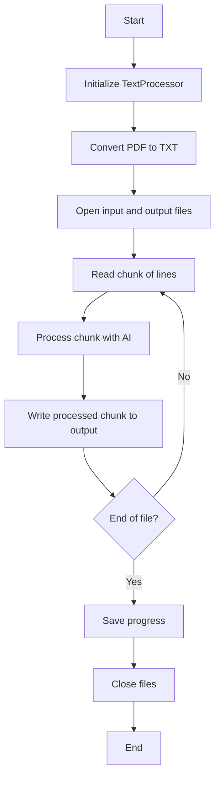

# LineCorrector API Reference

## Class: TextProcessor

A text processor that corrects line formatting in PDF files and text documents.

## Related Modules
- [DeerTick Main](deertick_doc.md)
- [Agent](agent_doc.md)

This module is used for correcting line formatting in the DeerTick project. For an overview of how it fits into the larger system, see the [DeerTick Main Documentation](deertick_doc.md).

### Constructor

```python
TextProcessor(model="cohere/command-r-plus-08-2024", provider="openrouter", chunk_size=5, system_prompt=None)
```

- `model` (str): The AI model to use for text processing.
- `chunk_size` (int): Number of lines to process in each chunk.
- `provider` (str): The AI provider to use.
- `system_prompt` (str or None): Custom system prompt for the AI agent.

### Attributes

- `agent` (Agent): An AI agent for text processing.
- `chunk_size` (int): Number of lines to process in each chunk.
- `default_system_prompt` (str): Default system prompt for the AI agent.
- `logger` (logging.Logger): Logger for the TextProcessor.

### Methods

#### setup_logging()
Sets up logging for the TextProcessor.

#### pdf_to_txt(pdf_file, txt_file)
Converts a PDF file to a text file.
- `pdf_file` (str): Path to the input PDF file.
- `txt_file` (str): Path to the output text file.
Returns: None or result of handle_error if an exception occurs.

#### correct_line_formatting(input_file, output_file, resume_line=0)
Corrects line formatting in the input file and writes to the output file.
- `input_file` (str): Path to the input text file.
- `output_file` (str): Path to the output text file.
- `resume_line` (int): Line number to resume processing from.
Returns: None or result of handle_error if an exception occurs.

#### process_chunk(chunk, outfile)
Processes a chunk of lines using the AI agent and writes the result to the output file.
- `chunk` (list): List of lines to process.
- `outfile` (file): Output file object to write processed lines to.

#### handle_error(error_message, file_path)
Handles errors that occur during processing.
- `error_message` (str): Error message to log.
- `file_path` (str): Path of the file where the error occurred.
Returns: New file path if the user chooses to try again, or exits the program.

### Usage Example

```python
processor = TextProcessor(chunk_size=10, model="gpt-3.5-turbo", provider="openai")
processor.pdf_to_txt("input.pdf", "input.txt")
processor.correct_line_formatting("input.txt", "output.txt")
```

## Flow


## Dependencies

- PyPDF2
- deertick.Agent
- os
- argparse
- logging
- sys
- traceback

## Notes

- The processor can handle both PDF and text input files.
- It processes text in chunks to manage memory usage and allow for interruption and resumption.
- Progress is saved after each chunk, allowing for resumption of interrupted processing.
- Custom system prompts can be provided to tailor the AI's behavior.
- Error handling includes detailed logging and options for user intervention.

## Command Line Interface (CLI)

The `line_correct.py` script can be run from the command line with various options. Here's how to use the CLI:

### Basic Usage

```
python line_correct.py input_file output_file
```

- `input_file`: Path to the input PDF file
- `output_file`: Path to the output text file

### Optional Arguments

- `--chunk_size CHUNK_SIZE`: Number of lines per chunk (default: 5)
- `--model MODEL`: AI model to use (default: "cohere/command-r-plus-08-2024")
- `--provider PROVIDER`: AI provider to use (default: "openrouter")
- `--keep_txt`: Keep the intermediate text file
- `--system_prompt SYSTEM_PROMPT`: Custom system prompt for the AI
- `--resume`: Resume from last saved progress

### Examples

1. Basic usage:
   ```
   python line_correct.py input.pdf output.txt
   ```

2. Specifying chunk size and model:
   ```
   python line_correct.py input.pdf output.txt --chunk_size 10 --model "gpt-3.5-turbo"
   ```

3. Using a custom system prompt and keeping the intermediate file:
   ```
   python line_correct.py input.pdf output.txt --system_prompt "Your custom prompt here" --keep_txt
   ```

4. Resuming from last saved progress:
   ```
   python line_correct.py input.pdf output.txt --resume
   ```

### CLI Flow

1. The script parses command-line arguments using `argparse`.
2. It creates a `TextProcessor` instance with the specified or default parameters.
3. If not resuming, it converts the input PDF to a text file.
4. If resuming, it checks for a progress file and resumes from the last processed line.
5. It processes the text file, correcting line formatting.
6. If an error occurs, it prompts the user to try again with a different input file or exit.
7. After processing, it cleans up the intermediate text file unless `--keep_txt` is specified.

The CLI provides flexibility in how the script is used, allowing for customization of processing parameters and handling of different scenarios like resuming interrupted jobs.
