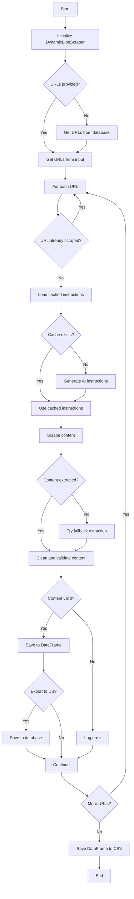

# DynamicBlogScraper API Reference

## Class: DynamicBlogScraper

A dynamic web scraper that uses AI-generated instructions to extract content from blog posts.

## Related Modules
- [DeerTick Main](deertick_doc.md)
- [Agent](agent_doc.md)
- [Database Manager](db_doc.md)

This module is used for web scraping in the DeerTick project. For an overview of how it fits into the larger system, see the [DeerTick Main Documentation](deertick_doc.md).

### Constructor

```python
DynamicBlogScraper(export_to_db=False)
```

- `export_to_db` (bool): If True, scraped data will be exported to a database.

### Attributes

- `bs_docs` (str): Instructions for generating BeautifulSoup commands.
- `output_dir` (str): Directory to save scraped data.
- `df` (pandas.DataFrame): Stores scraped data.
- `system_prompt_articles` (str): Prompt for AI to generate scraping instructions.
- `sleep_time` (float): Delay between scraping requests.
- `export_to_db` (bool): Whether to export data to database.
- `db_manager` (DatabaseManager): Manages database operations if `export_to_db` is True.

### Methods

#### async initialize_db()
Initializes the database connection and creates necessary tables.

#### async export_to_database(data)
Exports scraped data to the database.
- `data` (list): [URL, title, content, full_text]

#### async get_urls_from_database()
Retrieves all URLs from the database that have been scraped.
Returns: List of URLs.

#### async get_scraped_data_from_database()
Retrieves all scraped data from the database.
Returns: List of dictionaries containing scraped data.

#### split_content(content, max_length=4000)
Splits content into chunks of maximum length.
- `content` (str): Text to split.
- `max_length` (int): Maximum length of each chunk.
Returns: List of content chunks.

#### clean_html(html)
Removes script and style elements from HTML content.
- `html` (str): HTML content to clean.
Returns: Cleaned text content.

#### process_instructions(instructions, html_content)
Processes BeautifulSoup instructions to extract content from HTML.
- `instructions` (list): BeautifulSoup instructions.
- `html_content` (str): HTML content to process.
Returns: Extracted content.

#### get_cache_key(url)
Generates a cache key for a given URL.
- `url` (str): URL to generate key for.
Returns: MD5 hash of the URL.

#### save_to_cache(url, instructions)
Saves scraping instructions to cache.
- `url` (str): URL of the scraped page.
- `instructions` (list): Scraping instructions to cache.

#### load_from_cache(url)
Loads scraping instructions from cache.
- `url` (str): URL to load instructions for.
Returns: Cached instructions or None if not found.

#### scrape_blog(url)
Scrapes a blog post using AI-generated or cached instructions.
- `url` (str): URL of the blog post to scrape.
Returns: List containing [URL, title, cleaned_content, full_text].

#### get_unique_filepath(directory, filename)
Generates a unique filepath by adding a number to the end of the filename if it already exists.
- `directory` (str): Directory to save the file.
- `filename` (str): Desired filename.
Returns: Unique filepath.

#### ensure_cache_dir()
Creates the cache directory if it doesn't exist.

#### validate_content(url, title, content)
Validates the scraped content.
- `url` (str): URL of the scraped page.
- `title` (str): Title of the scraped content.
- `content` (str): Scraped content.
Returns: Tuple (is_valid, validation_message).

#### async run(urls=None)
Runs the scraper on a list of URLs or fetches from database if not provided.
- `urls` (list, optional): List of URLs to scrape.

#### get_urls_from_source(source)
Creates a list of URLs from various source types (CSV, DataFrame, TXT, MD).
- `source` (str or pandas.DataFrame): Source of URLs.
Returns: List of URLs.

#### extract_content_fallback(soup)
Extracts content using fallback methods if AI-generated instructions fail.
- `soup` (BeautifulSoup): Parsed HTML content.
Returns: Extracted content as string or None.

### Usage Example

```python
scraper = DynamicBlogScraper(export_to_db=True)
urls = scraper.get_urls_from_source("urls.csv")
asyncio.run(scraper.run(urls))
```

## Flow


## Dependencies

- niquests
- beautifulsoup4
- pandas
- asyncio
- Agent (custom class)
- DatabaseManager (custom class)

## Notes

- The scraper uses AI to generate scraping instructions for each URL.
- It implements caching to store and reuse scraping instructions.
- The scraper can export data to a CSV file and/or a database.
- It includes fallback methods for content extraction if AI-generated instructions fail.
- The scraper implements polite scraping with delays between requests.